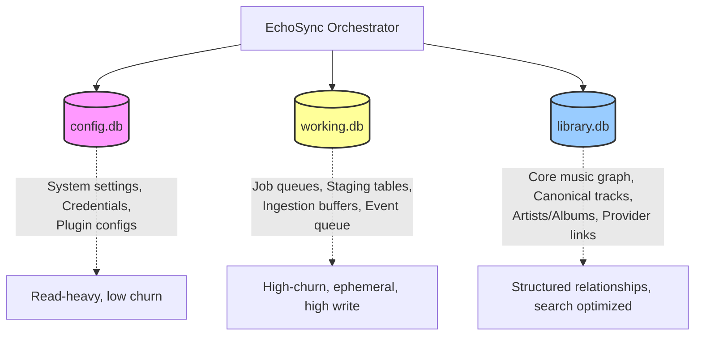
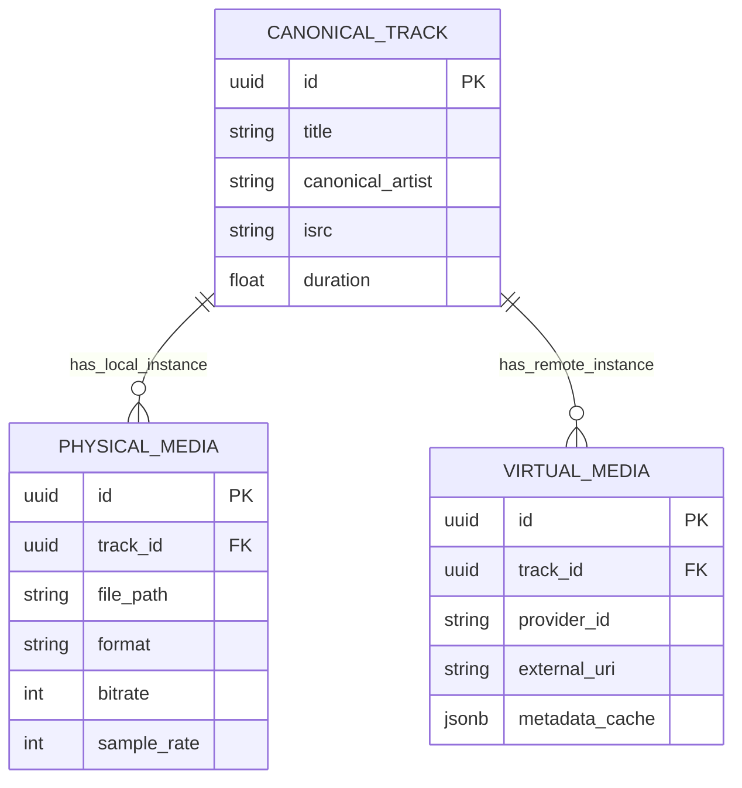
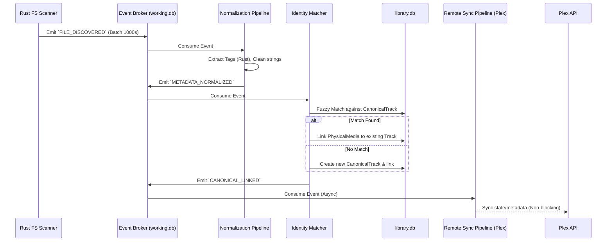

# EchoSync Architectural Master Blueprint

## 1. Executive Summary

EchoSync is evolving into a high-performance, audiophile-grade universal synchronization and media server platform. To break free from legacy bottlenecks (single-threaded Python loops, monolithic database contention, and tightly coupled worker logic), this blueprint outlines a hybrid architecture. By fusing the rapid development and rich ecosystem of Python (FastAPI/Orchestration) with the raw, multi-threaded performance of Rust (PyO3 Extension Module), EchoSync will achieve unprecedented speeds for local file ingestion and metadata processing.

This blueprint establishes a robust, decoupled event-driven architecture, a multi-database strategy to eliminate lock contention, and an entity model that seamlessly bridges local physical files with remote virtual instances.

## 2. Core System Architecture: Hybrid Python + Rust

To maintain zero-config deployment via a single Docker container while achieving maximum performance, EchoSync will utilize a monolith container model embedding a native Rust extension.

*   **Python (FastAPI & Orchestration):** Handles the RESTful API, SvelteKit frontend contracts, plugin ecosystem routing, and high-level business logic orchestration.
*   **Rust Core (PyO3):** Compiled via `maturin` as a native Python extension module. Rust assumes responsibility for CPU and I/O bound tasks:
    *   High-speed, multi-threaded filesystem walking (indexing 50,000+ files in < 2 seconds).
    *   Byte-level metadata extraction (parsing FLAC, WAV, DSD, MP3, M4A headers without GIL contention).
    *   Fuzzy metadata matching and deduplication algorithms.
    *   Non-blocking, safe tag writing.

## 3. Database Engine & State Architecture

### 3.1. The Repository Pattern & DB Engine Abstraction

The architecture dictates a strict Repository Pattern to abstract the ORM from the orchestration layer. This ensures that the application logic does not leak SQL dialects or ORM specifics.
*   **Default (Self-Hosted):** Zero-config SQLite in WAL (Write-Ahead Logging) mode for high concurrency out-of-the-box.
*   **Enterprise / Heavyweight:** Environment-flag enabled PostgreSQL support, unlocking advanced features like `pgvector` for recommendation models, multi-user concurrency, and native JSONB.

### 3.2. Strict 3-Database Scope Split

To eradicate SQLite lock contention and optimize I/O patterns, the system state is partitioned into three distinct databases:

## 4. Entity Model: Canonical vs. Virtual/Physical

The data model is completely separated from the storage medium. A track is an abstract concept, while a FLAC file or a Spotify URL is merely a provider instance.

*   **CanonicalTrack:** The abstract musical composition (e.g., "Thriller" by Michael Jackson). It holds the unified metadata (ISRC, global release date).
*   **PhysicalMedia:** A local filesystem instance linked to the CanonicalTrack (e.g., `/mnt/music/thriller.flac`, contains audio stream properties, bit depth, sample rate).
*   **VirtualMedia:** A remote or streaming instance linked to the CanonicalTrack (e.g., Plex `ratingKey: 1234`, Navidrome ID, Spotify URI).

## 5. Decoupled Event Engine & Async Pipelines

Ingestion and synchronization processes are modeled as discrete pipelines connected by a persistent message broker. This ensures local filesystem scanning never blocks on remote API calls.

*   **Broker Foundation:** An embedded, high-throughput SQLite-backed queue residing in `working.db` (or Rust in-memory crossbeam channels). Scales via interface hooks to Redis or RabbitMQ when PostgreSQL is enabled.

### Ingestion Pipeline Flow

## 6. Audiophile Media Server & DSP Engine Vision

EchoSync will act as a premier self-hosted streaming server (Subsonic/WebDAV compatible). The theoretical pipeline for the streaming engine includes:
*   **Bit-Perfect Direct Play:** Serving raw audio bytes (FLAC/DSD) via zero-copy byte-range HTTP streams.
*   **Server-Side DSP & Convolution:** Pluggable Rust audio processing graphs for room correction (convolution filters) or high-quality resampling (SoX resampler bindings) before transit.
*   **Gapless Pre-Fetching Buffers:** Proactive client-side buffer management APIs.
*   **Multi-Client Synchronized Broadcast:** Clock-synchronized multicast streaming for whole-house audio synchronization.

## 7. Pragmatic Implementation Roadmap (4-Phase Plan)

Transitioning from the legacy `database_update_worker.py` to the new architecture will be executed in phases to ensure uninterrupted service for existing FastAPI endpoints and the Svelte frontend.

### Phase 1: Core Foundation & Database Split
*   **Goal:** Establish the Rust PyO3 build pipeline and partition the database.
*   **Actions:**
    1. Integrate `maturin` into the Docker build process and bootstrap the `echosync_core` Rust module.
    2. Implement the `working.db`, `config.db`, and `library.db` split using SQLite (WAL).
    3. Route existing configuration reads to `config.db` and ephemeral state to `working.db`.

### Phase 2: Schema Migration & Repository Pattern Abstraction
*   **Goal:** Implement the Canonical/Virtual entity model and abstract the ORM.
*   **Actions:**
    1. Define the abstract Repository interfaces in Python.
    2. Implement the SQLite/SQLAlchemy backend for the interfaces.
    3. Migrate existing database tracks to the `CanonicalTrack` + `PhysicalMedia` / `VirtualMedia` schema.
    4. Port frontend/FastAPI reads to use the new Repository interfaces.

### Phase 3: Decoupled Async Event Queues & Ingestion
*   **Goal:** Replace legacy sequential processing with event-driven pipelines.
*   **Actions:**
    1. Implement the SQLite-backed Event Broker in `working.db`.
    2. Port the legacy `database_update_worker` logic into discrete event consumers (Normalization, Matching, Remote Sync).
    3. Implement the high-speed Rust filesystem scanner to emit discovery events.
    4. Deprecate legacy ingestion loops.

### Phase 4: Media Streaming & Legacy Loop Deprecation
*   **Goal:** Enable self-hosted streaming and clean up technical debt.
*   **Actions:**
    1. Expose Subsonic/WebDAV compatible streaming endpoints via FastAPI, backed by Rust I/O streaming.
    2. Fully remove `database_update_worker.py`, `bulk_operations.py`, and fragile plugin strings.
    3. Finalize documentation for the new DSP/Convolution hook points.
