# LocalMedia Ingestion, Telemetry & Enhancer Architecture Audit

## Executive Summary
This document provides a comprehensive, read-only architectural audit of EchoSync's physical file ingestion, deduplication, schema constraints, and metadata enhancement pipeline. It investigates why `mtime` and `inode` telemetry are consistently `NULL` in the `local_media` table, analyzes path uniqueness and multi-media track aggregation, details the mechanics of the `metadata_enhancer.py` iteration loop, and defines the architectural roadmap to invert the enhancer from Track-driven to `LocalMedia`-driven processing.

---

## 1. `LocalMedia` Ingestion & Upsert Logic Audit

### 1.1 Ingestion Flow & Code Path
The ingestion pipeline follows a 3-step boundary across the Rust FFI, Ingestion Orchestrator, and Track Repository:

1. **Native Probing (`echosync_core` / `src/metadata/extractor.rs` L271-298, `src/lib.rs` L54-92)**:
   - `MetadataExtractor::extract(path)` inspects the file on disk using `std::fs::metadata`.
   - It records `file_size_bytes = m.len()`, `mtime = Some(dur.as_secs_f64())`, and `inode = Some(m.ino())` (on Unix platforms).
   - In `src/lib.rs` (lines 87-89), `track_metadata_to_pydict` binds these values into the Python dictionary:
     ```rust
     dict.set_item("file_size_bytes", meta.file_size_bytes)?;
     dict.set_item("mtime", meta.mtime)?;
     dict.set_item("inode", meta.inode)?;
     ```

2. **Scanner & Service Layer (`services/library_sync_service.py` L71-136, L311-338)**:
   - In `LibrarySyncService.sync_library`, a rapid directory walk (`os.walk`) compares `os.stat(file_path).st_mtime` against the database state `db_state[file_path] = r.mtime or 0.0`.
   - For dirty or new files, `parse_file(file_path)` invokes `echosync_core.read_metadata(path)` or `extract_metadata(path)` to obtain `raw_dict`.
   - `raw_dict` is passed to `_parse_telemetry_dict(raw_dict)` to create an `EchosyncTrack` with attached `EchosyncMedia`.

3. **Telemetry Parsing Gap (`core/orchestrator/ingestion.py` L48-93)**:
   - In `_parse_telemetry_dict`, the flat FFI dictionary is parsed to construct `EchosyncMedia`:
     ```python
     # core/orchestrator/ingestion.py L73-93
     flat_file_path = raw_dict.pop("file_path", None)
     flat_file_format = raw_dict.pop("file_format", None) or raw_dict.pop("codec", None)
     flat_bitrate = raw_dict.pop("bitrate", None)
     flat_sample_rate = raw_dict.pop("sample_rate", None)
     flat_bit_depth = raw_dict.pop("bit_depth", None)
     flat_channels = raw_dict.pop("channels", None)
     flat_file_size = raw_dict.pop("file_size_bytes", None) or raw_dict.pop("file_size", None)
     ```
   - **CRITICAL DEFECT**: `mtime` and `inode` are **never popped or extracted** from `raw_dict`!
   - As a result, when `EchosyncMedia` is instantiated (lines 83-92), `mtime` and `inode` default to `None`.

4. **Database Upsert Layer (`core/database/repositories/track_repo.py` L782-826)**:
   - In `TrackRepository._execute_bulk_upsert`, `media_values` dicts are assembled from `m: EchosyncMedia`:
     ```python
     # core/database/repositories/track_repo.py L789-802
     media_values.append({
         "media_id": m.media_id if m.media_id else generate_nanoid(),
         "track_id": track_id,
         "file_path": canon_path,
         "file_format": getattr(m, "file_format", None),
         "bitrate": getattr(m, "bitrate", None),
         "sample_rate": getattr(m, "sample_rate", None),
         "bit_depth": getattr(m, "bit_depth", None),
         "channels": getattr(m, "channels", None),
         "file_size_bytes": getattr(m, "file_size_bytes", None),
         "inode": getattr(m, "inode", None),      # Always None
         "mtime": getattr(m, "mtime", None),      # Always None
         "added_at": now,
     })
     ```
   - SQLite executes `sqlite_insert(LocalMedia).values(m_chunk).on_conflict_do_update(index_elements=["file_path"], set_={...})`.
   - Because `m.inode` and `m.mtime` are `None`, every `LocalMedia` row is inserted and updated with `NULL` for `mtime` and `inode`.

### 1.2 Consequence on Incremental Scanning
In `services/library_sync_service.py` (line 79), `db_state[r.file_path] = r.mtime or 0.0`. Because all rows have `NULL` mtime, `db_mtime` evaluates to `0.0`. Every existing file on disk (`st_mtime > 0.0`) is perpetually flagged as dirty (`st_mtime > db_mtime`), triggering full metadata extraction on every incremental scan cycle.

---

## 2. Path Duplication & Schema Constraints Audit

### 2.1 Schema Definition vs SQLite Reality
- **ORM Model (`database/music_database.py` L472-488)**:
  `LocalMedia.file_path` is defined as `Mapped[str] = mapped_column(String, unique=True, nullable=False)`.
- **Database Schema (`data/music_library.db`)**:
  Inspection via `PRAGMA index_list('local_media')` confirms `sqlite_autoindex_local_media_1` exists on `file_path` (`unique: 1`).
- **Upsert Integrity**:
  `TrackRepository._execute_bulk_upsert` relies on SQLite `on_conflict_do_update(index_elements=["file_path"])`. This prevents duplicate identical `file_path` strings from being inserted into `local_media`.

### 2.2 How Multi-Media "Duplicate" Rows Accumulate Under Tracks
Although `local_media.file_path` strings are unique per row, multiple distinct physical files are aggregated under the same `Track` record via logical consolidation in `TrackRepository._get_or_assign_sync_id` (`core/database/repositories/track_repo.py` L614-650):

```python
# core/database/repositories/track_repo.py L615-640
key = (norm_title, a_id, norm_ed)
if key in existing_track_map:
    sid, existing_dur = existing_track_map[key]
    if existing_dur is not None and t_dur is not None and abs(t_dur - existing_dur) > 5000:
        sid = generate_nanoid()
    else:
        t.sync_id = sid
        return sid
```

When multiple files share:
1. The same normalized title (e.g. `normalize_title("Track Name")`)
2. The same primary `artist_id`
3. The same `edition` string
4. A duration within a 5-second tolerance (`abs(t_dur - existing_dur) <= 5000ms`)

They are assigned the identical `sync_id`. During upsert, `TrackRepository` links both distinct `LocalMedia` rows (e.g., `/Music/Track.flac` and `/Music/Track (1).flac`, or separate copies in different folders) to the **single** `Track.id`.

---

## 3. Metadata Enhancer Iteration Loop Audit (`services/metadata_enhancer.py`)

### 3.1 Candidate Selection Query
In `RetroactiveEnhancer.enhance_library_metadata` (`services/metadata_enhancer.py` L2015-2023) and `TrackRepository.get_tracks_for_enhancement` (`core/database/repositories/track_repo.py` L179-300):

```python
# core/database/repositories/track_repo.py L192-202
query = (
    session.query(Track)
    .join(LocalMedia, LocalMedia.track_id == Track.id)
    .outerjoin(Artist, Track.artist_id == Artist.id)
    .outerjoin(Album, Track.album_id == Album.id)
)
query = query.options(
    joinedload(Track.media_files),
    joinedload(Track.artist),
    joinedload(Track.album),
)
```

- **Yielded Data Structure**: The query yields **`list[Track]`** ORM entities.
- **Conversion**: In `metadata_enhancer.py` L2055, each `Track` is transformed into an `EchosyncTrack` domain object.

### 3.2 Multi-Media Homogenization & Risk Analysis
When a `Track` entity possesses multiple attached `LocalMedia` files (`len(track.media_files) > 1`):

1. **First-File Dominance (`services/metadata_enhancer.py` L1134-1136, L2625)**:
   `first_media = media_files[0]` is arbitrarily selected as the representative file.
   Fingerprint generation, duration checks, MusicBrainz/Spotify lookups, and local chromaprint cache matching are performed **only on `first_media`**.

2. **Tag Homogenization (`services/metadata_enhancer.py` L1263-1274, L3008-3024)**:
   When resolution succeeds, physical tag writes (`self.tag_file_verified(m_path, result_payload)`) are executed iteratively across **every** `media` in `track.media_files`.

3. **Fingerprint Overwrite (`services/metadata_enhancer.py` L1202-1217, L2961-3006)**:
   The `AudioFingerprint` records for all associated `media_id`s are updated with the `chromaprint` and `acoustid_id` resolved from `first_media`.

4. **Architectural Failure Mode**:
   If two distinct audio recordings (e.g., an original mix and an unlabeled radio edit, or two different releases with identical titles) were clustered under the same `Track` row, enhancing the track forces the secondary file to receive the first file's tags and AcoustID fingerprint, destroying the distinct metadata and acoustic identity of the secondary file.

---

## 4. Architectural Gap Analysis & Migration Roadmap

### 4.1 Inversion: Track-Driven vs LocalMedia-Driven Processing

```mermaid
flowchart TD
    subgraph Current_Track_Driven ["Current Architecture (Track-Driven)"]
        T1["Query tracks table (JOIN local_media)"] --> T2["Yield Track entity"]
        T2 --> T3["Pick first media file: media_files[0]"]
        T3 --> T4["Resolve metadata against first file"]
        T4 --> T5["Write resolved tags to ALL attached media files (Homogenization risk)"]
        T4 --> T6["Update Track ORM model"]
    end

    subgraph Proposed_Media_Driven ["Proposed Architecture (LocalMedia-Driven)"]
        M1["Query local_media table (JOIN tracks)"] --> M2["Yield distinct LocalMedia entity"]
        M2 --> M3["Inspect file_path, mtime & inode"]
        M3 --> M4["Generate acoustic fingerprint per LocalMedia"]
        M4 --> M5["Resolve canonical metadata for individual file"]
        M5 --> M6["Write verified tags directly to file"]
        M6 --> M7["Reconcile/Decouple Track: link to existing Track or split into new Track"]
        M7 --> M8["Update LocalMedia mtime/inode/telemetry"]
    end
```



---

### 4.2 Impact Assessment & Component Breakdown

| Task Area | Component / Files | Impact Score | Description |
| :--- | :--- | :---: | :--- |
| **1. Database Schema & Alembic** | `database/migrations/music/versions/`, `database/music_database.py` | **Low** | Create an explicit Alembic migration ensuring `ix_local_media_file_path` unique index and `ix_local_media_mtime` / composite `(file_path, mtime)` index exist on SQLite. |
| **2. Ingestion & Telemetry Upsert** | `core/orchestrator/ingestion.py`, `services/library_sync_service.py`, `core/database/repositories/track_repo.py` | **Low - Medium** | 1. Update `_parse_telemetry_dict` in `ingestion.py` (L73-93) to pop `mtime` and `inode` from `raw_dict` into `EchosyncMedia`.<br>2. Ensure `library_sync_service.py` passes `st_mtime` and `st_ino`.<br>3. Ensure `TrackRepository._execute_bulk_upsert` persists non-null `mtime` and `inode`. |
| **3. Enhancer Inversion (LocalMedia-Driven)** | `services/metadata_enhancer.py`, `core/database/repositories/track_repo.py`, `services/retroactive_metadata_worker.py` | **Medium - High** | 1. Add `TrackRepository.get_media_for_enhancement` streaming `LocalMedia` items.<br>2. Invert `RetroactiveEnhancer.enhance_library_metadata` to iterate per `LocalMedia` record.<br>3. Decouple tracks when a file's resolved MBID/fingerprint differs from its parent `Track`.<br>4. Update `LocalMedia.mtime` on successful physical tag write. |

---

## 5. Exact Implementation Checklist for Future Execution

### Phase 1: Telemetry & Ingestion Invariant Fix
- [ ] In `core/orchestrator/ingestion.py` (`_parse_telemetry_dict`):
  ```python
  flat_mtime = raw_dict.pop("mtime", None)
  flat_inode = raw_dict.pop("inode", None)
  ```
  Pass `mtime=flat_mtime` and `inode=flat_inode` into `EchosyncMedia(...)`.
- [ ] In `services/library_sync_service.py`:
  Ensure `raw_dict` receives `stat.st_mtime` and `stat.st_ino` if not already provided by `echosync_core`.
- [ ] In `database/migrations/music/versions/`:
  Add Alembic migration indexing `local_media(file_path, mtime)`.

### Phase 2: Enhancer Queue Inversion
- [ ] In `core/database/repositories/track_repo.py`:
  Implement `get_media_for_enhancement(session, batch_size, ...)` selecting from `LocalMedia` joined to `Track`.
- [ ] In `services/metadata_enhancer.py`:
  Refactor `enhance_library_metadata` to process `LocalMedia` records individually:
  - Extract tags and generate fingerprint for the specific `LocalMedia`.
  - Match candidate against `ResolutionEngine`.
  - Write physical tags and update `LocalMedia.mtime`.
  - If resolved `musicbrainz_track_id` matches the current `Track`, update `Track`; otherwise, instantiate a new `Track` for this `LocalMedia` (decoupling).

