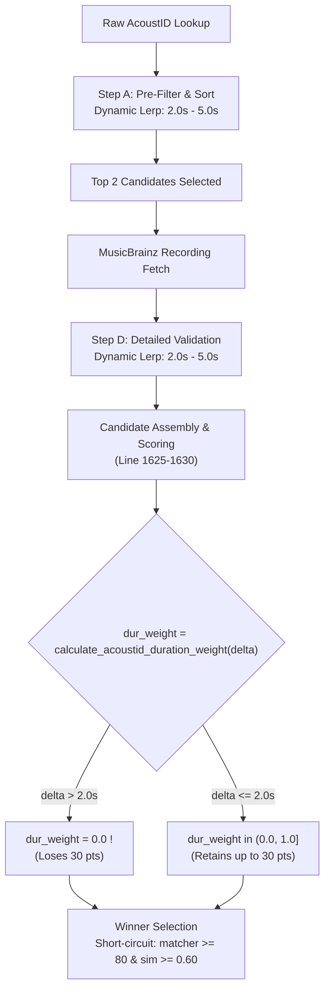

# Architectural Audit: Duration Decay Curves & Matching Profiles

**Target Subsystems**: `core/matching_engine/`, `core/metadata/`, `services/`, `web/routes/`  
**Date**: September 2026  
**Status**: Completed Architectural Review (Read-Only)

---

## Executive Summary

EchoSync employs duration evaluation across multiple independent subsystems to perform candidate gating, metadata resolution, deduplication, and playlist synchronisation. 

This audit reveals **architectural fragmentation** across duration decay logic:
1. **Three Divergent Mathematical Decay Models**: 
   - A degree-6 continuous polynomial decay in [`core/matching_engine/matching_engine.py`](file:///c:/Users/bheem/VScode-Projects/EchoSync/core/matching_engine/matching_engine.py#L132-L151).
   - A quadratic parabolic decay curve with a strict 2.0s hard cutoff in [`core/metadata/scoring.py`](file:///c:/Users/bheem/VScode-Projects/EchoSync/core/metadata/scoring.py#L6-L11).
   - A linear decay curve with an 8.0s cutoff in [`core/metadata/scoring.py`](file:///c:/Users/bheem/VScode-Projects/EchoSync/core/metadata/scoring.py#L14-L18).
2. **Disconnected Configuration Contracts**:
   - `ScoringWeights` and profiles in [`core/matching_engine/scoring_profile.py`](file:///c:/Users/bheem/VScode-Projects/EchoSync/core/matching_engine/scoring_profile.py#L33-L116) define `duration_tolerance_ms`, yet the core duration calculation (`_calculate_duration_match` in [`matching_engine.py`](file:///c:/Users/bheem/VScode-Projects/EchoSync/core/matching_engine/matching_engine.py#L1612-L1628)) completely ignores `self.weights.duration_tolerance_ms` and hardcodes `strict=False` ($T_{\text{base}}=5.0\text{s}, T_{\text{limit}}=6.0\text{s}$).
3. **Stage 3 AcoustID Disconnect**:
   - While Step A and Step D in [`core/metadata/engine.py`](file:///c:/Users/bheem/VScode-Projects/EchoSync/core/metadata/engine.py#L268-L283) now use a dynamic lerp threshold ($2.0\text{s} \to 5.0\text{s}$) to admit candidates with padding, the final candidate scoring at line 1625 evaluates `calculate_acoustid_duration_weight`, which collapses to `0.0` for any delta $> 2.0\text{s}$. Candidates admitted with $2.1\text{s} - 5.0\text{s}$ deltas lose all 30 duration points in the candidate ranking stage.
4. **Leaked Heuristics in Route Layers**:
   - [`web/routes/playlists.py`](file:///c:/Users/bheem/VScode-Projects/EchoSync/web/routes/playlists.py#L1082-L1150) attempts runtime mutation of `matching_engine.weights.duration_tolerance_ms` (setting it to 90,000ms or 15,000ms) inside playlist synchronization loops, creating an illusion of tolerance adjustment that is actually dead code due to the decoupling noted in point (2).

---

## 1. Inventory of Matching Profiles & Duration Configurations

Defined in [`core/matching_engine/scoring_profile.py`](file:///c:/Users/bheem/VScode-Projects/EchoSync/core/matching_engine/scoring_profile.py):

### ScoringWeights Structure ([`scoring_profile.py:L33-L116`](file:///c:/Users/bheem/VScode-Projects/EchoSync/core/matching_engine/scoring_profile.py#L33-L116))
Each profile wraps an instance of `ScoringWeights`:
- `duration_weight: float = 0.2` (Relative weight in composite score assembly)
- `duration_tolerance_ms: int = 3000` (Target tolerance window)
- `enforce_duration_match: bool = False` (Boolean flag gating candidates whose duration delta exceeds tolerance)
- `fingerprint_weight: float = 0.0` (Weight allocated to acoustic waveform similarity)

### Profile Inventory

| Profile Class | File & Line Range | Duration Weight | Duration Tolerance | Enforce Duration Match | Fingerprint Weight | Intended Purpose |
| :--- | :--- | :--- | :--- | :--- | :--- | :--- |
| **`ExactSyncProfile`** | [`scoring_profile.py:L139-L190`](file:///c:/Users/bheem/VScode-Projects/EchoSync/core/matching_engine/scoring_profile.py#L139-L190) | `0.20` | `3,000ms` (3.0s) | `False` | `0.00` | High-confidence 1:1 sync (e.g. Spotify playlist track matching) |
| **`DownloadSearchProfile`** | [`scoring_profile.py:L191-L242`](file:///c:/Users/bheem/VScode-Projects/EchoSync/core/matching_engine/scoring_profile.py#L191-L242) | `0.20` | `5,000ms` (5.0s) | `True` | `0.00` | Ingestion & download candidate filtering (hard gate on duration) |
| **`LibraryImportProfile`** | [`scoring_profile.py:L243-L291`](file:///c:/Users/bheem/VScode-Projects/EchoSync/core/matching_engine/scoring_profile.py#L243-L291) | `0.30` | `8,000ms` (8.0s) | `False` | `0.60` | Full library scans and uncatalogued directory imports |
| **`AutoImportStrictProfile`** | [`scoring_profile.py:L292-L333`](file:///c:/Users/bheem/VScode-Projects/EchoSync/core/matching_engine/scoring_profile.py#L292-L333) | `0.20` | `3,000ms` (3.0s) | `False` | `0.00` | Automated headless ingestion with high precision bar |
| **`DuplicateDetectionProfile`** | [`scoring_profile.py:L334-L375`](file:///c:/Users/bheem/VScode-Projects/EchoSync/core/matching_engine/scoring_profile.py#L334-L375) | `0.15` | `5,000ms` (5.0s) | `False` | `0.45` | Intra-library duplicate and redundant edition detection |
| **`ConfigurableProfile`** | [`scoring_profile.py:L376-L406`](file:///c:/Users/bheem/VScode-Projects/EchoSync/core/matching_engine/scoring_profile.py#L376-L406) | Config-driven | Config-driven | Config-driven | Config-driven | Dynamic overrides via `ProfileFactory.create_from_config()` |

---

## 2. Duration Decay Curves & Mathematical Formulas

The codebase implements four distinct mathematical curves for duration evaluation:

```
           Duration Score Curves Comparison
 1.0 +---------+---------+
     |\        |*        |      --- Degree-6 Polynomial (MatchingEngine, Standard)
     | \       | *       |      ... Parabolic Decay (Metadata Scoring - AcoustID)
 0.8 |  \      |  *      |      - - Linear Waterfall (Metadata Scoring - Text)
     |   \     |   *     |
 0.6 |    \    |    *    |
     |     \   |     *   |
 0.4 |      \  |      *  |
     |       \ |       * |
 0.2 |        \|        *|
     |         +---------+
 0.0 +---------+---------+------->
    0s        2s        5s    6s   8s      |Δ Duration|
```

### 1. Degree-6 Continuous Polynomial Decay
- **Location**: [`core/matching_engine/matching_engine.py:L132-L151`](file:///c:/Users/bheem/VScode-Projects/EchoSync/core/matching_engine/matching_engine.py#L132-L151)
- **Function**: `calculate_duration_score(diff_ms: int, strict: bool = False) -> float`
- **Formula**:
  $$\Delta = |\text{duration}_{\text{source}} - \text{duration}_{\text{target}}|$$
  $$\text{decay} = \left( \frac{\Delta - T_{\text{base}}}{T_{\text{limit}} - T_{\text{base}}} \right)^6$$
  $$\text{score} = \begin{cases} 
  1.0 & \Delta \le T_{\text{base}} \\
  \max\left(0.0, 1.0 - \text{decay}\right) & T_{\text{base}} < \Delta < T_{\text{limit}} \\
  0.0 & \Delta \ge T_{\text{limit}}
  \end{cases}$$

- **Parameters by Mode**:
  - Standard Mode (`strict=False`):
    $$T_{\text{base}} = 5,000\text{ms (5.0s)}, \quad T_{\text{limit}} = 6,000\text{ms (6.0s)}$$
  - Strict Mode (`strict=True`):
    $$T_{\text{base}} = 2,000\text{ms (2.0s)}, \quad T_{\text{limit}} = 3,000\text{ms (3.0s)}$$
- **Mathematical Characteristics**:
  - Flat plateau at 1.0 for all $\Delta \le T_{\text{base}}$.
  - Extremely steep degree-6 rolloff between $T_{\text{base}}$ and $T_{\text{limit}}$:
    - At $50\%$ of decay band: $1.0 - (0.5)^6 = 1.0 - 0.0156 = 0.9844$.
    - At $80\%$ of decay band: $1.0 - (0.8)^6 = 1.0 - 0.2621 = 0.7379$.
    - At $100\%$ of decay band: drops abruptly to $0.0$.
- **Call Sites**:
  1. [`core/matching_engine/matching_engine.py:L1612-L1628`](file:///c:/Users/bheem/VScode-Projects/EchoSync/core/matching_engine/matching_engine.py#L1612-L1628) (`_calculate_duration_match`):
     Invoked during overall matching score calculation.
     ```python
     def _calculate_duration_match(self, track_duration: Optional[int], target_duration: Optional[int], tolerance_override_ms: Optional[int] = None) -> float:
         ...
         diff_ms = abs(track_duration - target_duration)
         return calculate_duration_score(diff_ms, strict=False)
     ```
     > [!WARNING]
     > **Architectural Discrepancy**: Notice that `tolerance_override_ms` is completely unused in the body, and `self.weights.duration_tolerance_ms` is ignored! The calculation hardcodes `strict=False` regardless of profile settings.
  2. [`core/matching_engine/matching_engine.py:L700-L702`](file:///c:/Users/bheem/VScode-Projects/EchoSync/core/matching_engine/matching_engine.py#L700-L702) (`calculate_title_duration_match`):
     Invoked when matching titles with exact duration verification:
     ```python
     duration_score = calculate_duration_score(duration_diff_ms, strict=True)
     confidence = 90.0 + (duration_score * 10.0)
     ```

---

### 2. Parabolic AcoustID Duration Weight
- **Location**: [`core/metadata/scoring.py:L6-L11`](file:///c:/Users/bheem/VScode-Projects/EchoSync/core/metadata/scoring.py#L6-L11)
- **Function**: `calculate_acoustid_duration_weight(delta_sec: float) -> float`
- **Formula**:
  $$\text{weight} = \begin{cases}
  \max\left(0.0, 1.0 - \left(\frac{|\Delta|}{2.0}\right)^2\right) & |\Delta| \le 2.0\text{s} \\
  0.0 & |\Delta| > 2.0\text{s}
  \end{cases}$$
- **Values**:
  - $\Delta = 0.0\text{s} \implies 1.0$
  - $\Delta = 0.5\text{s} \implies 1.0 - (0.25)^2 = 0.9375$
  - $\Delta = 1.0\text{s} \implies 1.0 - (0.5)^2 = 0.75$
  - $\Delta = 1.5\text{s} \implies 1.0 - (0.75)^2 = 0.4375$
  - $\Delta \ge 2.0\text{s} \implies 0.0$
- **Call Sites**:
  1. [`core/metadata/scoring.py:L48-L50`](file:///c:/Users/bheem/VScode-Projects/EchoSync/core/metadata/scoring.py#L48-L50) (`score_acoustid_candidate`):
     ```python
     duration_weight = calculate_acoustid_duration_weight(delta_sec)
     if duration_weight <= 0.0 or delta_sec > 2.0:
         return 0.0
     ```
  2. [`core/metadata/engine.py:L1625`](file:///c:/Users/bheem/VScode-Projects/EchoSync/core/metadata/engine.py#L1625) (`_resolve_acoustid` Stage 3 candidate ranking loop):
     ```python
     dur_weight = calculate_acoustid_duration_weight(delta_sec)
     cand_score = (matcher_score * 0.70) + (dur_weight * 30.0) + album_bonus
     ```

---

### 3. Linear Text Waterfall Duration Decay
- **Location**: [`core/metadata/scoring.py:L14-L18`](file:///c:/Users/bheem/VScode-Projects/EchoSync/core/metadata/scoring.py#L14-L18)
- **Function**: `calculate_text_duration_weight(delta_sec: float) -> float`
- **Formula**:
  $$\text{weight} = \begin{cases}
  \max\left(0.0, 1.0 - \frac{|\Delta|}{8.0}\right) & |\Delta| \le 8.0\text{s} \\
  0.0 & |\Delta| > 8.0\text{s}
  \end{cases}$$
- **Values**:
  - Linear slope of $-0.125/\text{sec}$ over an 8-second window:
    - $\Delta = 0.0\text{s} \implies 1.0$
    - $\Delta = 2.0\text{s} \implies 0.75$
    - $\Delta = 4.0\text{s} \implies 0.50$
    - $\Delta = 8.0\text{s} \implies 0.0$
- **Call Sites**:
  1. [`core/metadata/engine.py:L1868-L1872`](file:///c:/Users/bheem/VScode-Projects/EchoSync/core/metadata/engine.py#L1868-L1872) (`_resolve_text_waterfall` Stage 5 candidate ranking):
     ```python
     text_dur_weight = calculate_text_duration_weight(delta_sec)
     if text_dur_weight <= 0.0:
         continue
     score = score * text_dur_weight
     ```

---

### 4. Dynamic Duration Threshold Lerp (Gating Only)
- **Location**: [`core/metadata/engine.py:L268-L283`](file:///c:/Users/bheem/VScode-Projects/EchoSync/core/metadata/engine.py#L268-L283)
- **Function**: `_calculate_dynamic_duration_threshold(sim: float) -> float`
- **Formula**:
  $$T(\text{sim}) = \begin{cases}
  2.0\text{s} & \text{sim} \le 0.80 \\
  5.0\text{s} & \text{sim} \ge 0.95 \\
  2.0 + \left( \frac{\text{sim} - 0.80}{0.95 - 0.80} \right) \times (5.0 - 2.0) & 0.80 < \text{sim} < 0.95
  \end{cases}$$
- **Purpose**:
  Determines maximum allowable duration delta $|\text{target} - \text{candidate}|$ before dropping the candidate.
- **Call Sites**:
  1. [`core/metadata/engine.py:L1413`](file:///c:/Users/bheem/VScode-Projects/EchoSync/core/metadata/engine.py#L1413): Pre-filtering AcoustID query results before remote MusicBrainz network calls (Step A).
  2. [`core/metadata/engine.py:L1572`](file:///c:/Users/bheem/VScode-Projects/EchoSync/core/metadata/engine.py#L1572): Post-fetch validation of actual MusicBrainz recording duration (Step D).

---

### 5. Acoustic Reconciliation SQL Window
- **Location**: [`core/metadata/adapter.py:L286`](file:///c:/Users/bheem/VScode-Projects/EchoSync/core/metadata/adapter.py#L286)
- **Function**: `find_canonical_track_for_media(session, title, artist, duration_ms, fingerprint)`
- **Formula**:
  ```python
  Track.duration.between(dur_val - 3000, dur_val + 3000)
  ```
  Hard bounds SQL candidate tracks to within $\pm 3,000\text{ms}$ (3.0s) of the incoming file before performing native Rust chromaprint comparisons (`echosync_core.compare_chromaprints`).

---

## 3. Stage 3 AcoustID Candidate Evaluation & Scoring Discrepancy

### Pipeline Flow in `_resolve_acoustid` ([`core/metadata/engine.py:L1390-L1680`](file:///c:/Users/bheem/VScode-Projects/EchoSync/core/metadata/engine.py#L1390-L1680))



### Critical Architectural Discrepancy in Stage 3 Candidate Scoring

In [`core/metadata/engine.py`](file:///c:/Users/bheem/VScode-Projects/EchoSync/core/metadata/engine.py):
1. **Gating permits up to 5.0s**: Steps A and D use `_calculate_dynamic_duration_threshold(sim)` to permit duration differences up to $5.0\text{s}$ when title/artist similarity $\ge 0.95$.
2. **Scorer penalises anything $> 2.0\text{s}$ to zero**: At line 1625:
   ```python
   dur_weight = calculate_acoustid_duration_weight(delta_sec)
   cand_score = (matcher_score * 0.70) + (dur_weight * 30.0) + album_bonus
   ```
   If a valid master has a $3.8\text{s}$ difference due to silence padding and title similarity of $0.96$:
   - It **passes** Step A and Step D ($3.8\text{s} \le 5.0\text{s}$).
   - But `calculate_acoustid_duration_weight(3.8)` evaluates to **`0.0`** because the function is capped at $2.0\text{s}$.
   - The candidate's `cand_score` drops by **30 full points** out of 100!
   - This creates an internal contradiction where the gating logic acknowledges padding variance, but the scoring weight treats it as a fatal mismatch.

### Divergence Between `scoring.py` and `engine.py`

There are two conflicting candidate scorers:
1. `score_acoustid_candidate` in [`core/metadata/scoring.py:L40-L123`](file:///c:/Users/bheem/VScode-Projects/EchoSync/core/metadata/scoring.py#L40-L123):
   - Multiplicative duration penalty: `score = score * dur_weight`.
   - Hard veto: `if delta_sec > 2.0: return 0.0`.
   - Applies compilation penalty: `-35.0` points.
   - Applies live track penalty: `-50.0` points.
2. `_resolve_acoustid` candidate loop in [`core/metadata/engine.py:L1615-L1635`](file:///c:/Users/bheem/VScode-Projects/EchoSync/core/metadata/engine.py#L1615-L1635):
   - Additive duration scoring: `(matcher_score * 0.70) + (dur_weight * 30.0)`.
   - Studio album bonus: `+5.0` points.
   - **`_resolve_acoustid` never calls `score_acoustid_candidate`!** It reimplements candidate scoring inline.

---

## 4. Acoustic-Guided vs. Metadata-Fallback Branching

| Dimension | Acoustic-Guided Path (`_resolve_acoustid`) | Metadata Fallback Path (`_resolve_text_waterfall`) |
| :--- | :--- | :--- |
| **Fingerprint Present** | **Yes** (Chromaprint extracted via `echosync_core`) | **No** (Unfingerprinted, corrupt, or stream-only) |
| **Duration Source** | Exact audio stream probing (ms precision) | File tag or container header (often rounded to seconds) |
| **Pre-Query Gate** | Dynamic Lerp Threshold ($2.0\text{s} \to 5.0\text{s}$) | Elastic query parameter: `Track.duration.between(...)` |
| **Duration Decay Curve** | Parabolic $1 - (\Delta/2)^2$ (currently capped at 2.0s) | Linear $1 - (\Delta/8)$ (grace period up to 8.0s) |
| **Score Application** | Additive ($30\%$ total weight) | Multiplicative (`score = score * weight`) |
| **Hard Cutoff Veto** | $2.0\text{s} - 5.0\text{s}$ (Dynamic Lerp) | $8.0\text{s}$ (Strict cutoff drops candidate) |
| **Tolerance for Padding** | Medium (Silence at start/end of physical master) | High (Release differences, hidden tracks, vinyl rips) |

---

## 5. Audit for Leaked Heuristics in Services & Web Routes

### 1. `services/metadata_enhancer.py`
- **Audit Result: PASS (Clean)**
- **Finding**: Does not calculate duration decay curves or alter weights. It builds a `ResolutionRequest` containing `duration_ms=media.duration_ms` and delegates entirely to `MetadataResolutionEngine.resolve_track(req)`. Physical track reconciliation in `services/metadata_enhancer.py` delegates to `core/metadata/adapter.py:find_canonical_track_for_media`.

### 2. `web/routes/playlists.py`
- **Audit Result: VIOLATION & DEAD CODE**
- **Location**: [`web/routes/playlists.py:L1082-L1150`](file:///c:/Users/bheem/VScode-Projects/EchoSync/web/routes/playlists.py#L1082-L1150)
- **Code Inspection**:
  ```python
  # Tier A: Exact title match - expand duration tolerance
  matching_engine.weights.duration_tolerance_ms = 90000  # 90 seconds
  ...
  # Tier B: Strong artist match - moderate duration tolerance
  matching_engine.weights.duration_tolerance_ms = 15000  # 15 seconds
  ```
- **Architectural Findings**:
  1. **Layer Leak**: A web HTTP route handler directly mutates internal state on a singleton/shared `matching_engine` service instance.
  2. **Dead Code / False Security**: In [`core/matching_engine/matching_engine.py:L1612-L1628`](file:///c:/Users/bheem/VScode-Projects/EchoSync/core/matching_engine/matching_engine.py#L1612-L1628), `_calculate_duration_match` invokes:
     ```python
     calculate_duration_score(diff_ms, strict=False)
     ```
     `calculate_duration_score` has hardcoded parameters: $T_{\text{base}}=5000\text{ms}$ and $T_{\text{limit}}=6000\text{ms}$. It **never reads** `self.weights.duration_tolerance_ms`!
  3. Consequently, mutating `matching_engine.weights.duration_tolerance_ms = 90000` in `playlists.py` has **zero effect** on candidate scoring: any track with a delta $> 6.0\text{s}$ still receives a duration score of `0.0`.

---

## 6. Structural Recommendations: Unified Dual-Track Duration Evaluator

To eliminate fragmentation, dead code, and candidate gating/scoring contradictions, the duration scoring logic should be unified under a single component: `DualTrackDurationScorer`.

### Architecture Proposal

```
                    DualTrackDurationScorer
                              │
         ┌────────────────────┴────────────────────┐
         ▼                                         ▼
 Acoustic-Guided Track                   Metadata Fallback Track
(Fingerprint Confirmed)                 (Tag / Title / Catalog)
         │                                         │
 ┌───────┴────────┐                        ┌───────┴────────┐
 │ Base: 2.0s     │                        │ Base: 5.0s     │
 │ Max:  5.0s     │                        │ Max:  12.0s    │
 │ Lerp by Sim    │                        │ Linear / Sigm. │
 └────────────────┘                        └────────────────┘
```

1. **Unify the Mathematical Decay Formula**:
   Adopt an asymmetric smooth-step or generalised polynomial decay parameterized by $(T_{\text{base}}, T_{\text{max}})$:
   $$\text{score}(\Delta, T_{\text{base}}, T_{\text{max}}) = \begin{cases}
   1.0 & \Delta \le T_{\text{base}} \\
   1.0 - \left( \frac{\Delta - T_{\text{base}}}{T_{\text{max}} - T_{\text{base}}} \right)^2 & T_{\text{base}} < \Delta \le T_{\text{max}} \\
   0.0 & \Delta > T_{\text{max}}
   \end{cases}$$

2. **Align Gating and Scoring in Stage 3 (`_resolve_acoustid`)**:
   - Instead of gating with a dynamic threshold and scoring with a static 2.0s cutoff, pass the dynamic threshold $T_{\text{dyn}} = \text{lerp}(2.0, 5.0, \text{sim})$ into the duration scorer:
     - $T_{\text{base}} = 2.0\text{s}$ (100% score for $\Delta \le 2.0\text{s}$).
     - $T_{\text{max}} = T_{\text{dyn}}$ (Smooth decay down to 0 at $T_{\text{dyn}}$).
   - This ensures candidates admitted under high-similarity padding rules receive appropriate proportional duration points rather than dropping from 30 to 0.

3. **Wire `ScoringProfile.duration_tolerance_ms` to `calculate_duration_score`**:
   - Refactor `_calculate_duration_match` in `matching_engine.py` to forward `self.weights.duration_tolerance_ms` into `calculate_duration_score(diff_ms, base_tol=..., limit_tol=...)`.
   - Remove route-level mutations in `web/routes/playlists.py`. If playlist sync requires relaxed tolerances, pass an explicit `ScoringProfile` or query option instead of mutating shared engine state.

4. **Deprecate Duplicate Scorer in `core/metadata/scoring.py`**:
   - Harmonise `score_acoustid_candidate` in `scoring.py` with `_resolve_acoustid` in `engine.py`, or retire `score_acoustid_candidate` in favour of the unified evaluator.

