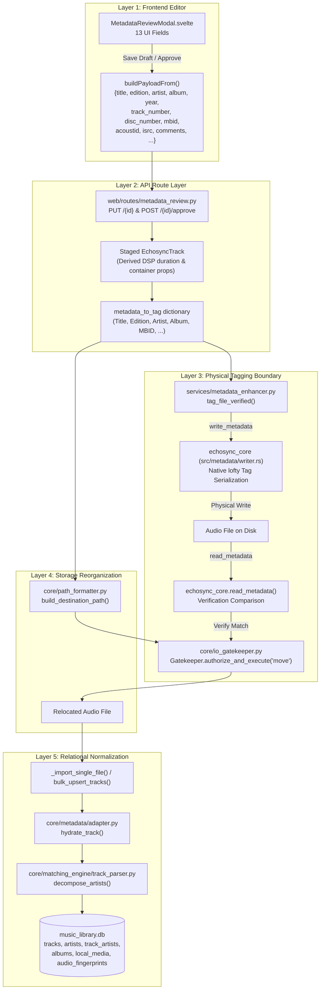

# EchoSync Metadata Lifecycle, Tags & Schema Audit

**Audit Status:** Complete & Verified  
**Scope:** Read-Only Architectural Audit across Frontend, API, Database, Path Formatter, and Native Rust Tagging  
**Audit Target:** End-to-End Data Flow from `MetadataReviewModal.svelte` through `echosync_core`  

---

## 1. Executive Summary & Architecture Lifecycle

EchoSync manages metadata across five architectural layers to guarantee library consistency, lossless edition preservation, and bit-exact audio fingerprint alignment:



---

## 2. End-to-End Mapping Matrix

This matrix tracks every user-facing metadata property from the UI through the API, database schema, physical audio tags, and destination path tokens.

| UI Field (`MetadataReviewModal`) | Frontend Payload Key | API Route Key Handling (`metadata_review.py`) | Database Table & Column (`music_database.py`) | Native Physical Audio Tag (`src/metadata/writer.rs`) | Destination Path Token (`path_formatter.py`) |
| :--- | :--- | :--- | :--- | :--- | :--- |
| **Title** | `title` | `final_metadata["title"]` -> `staged_track.title` | `tracks.title`, `tracks.normalized_title`, `tracks.sort_title` | `ItemKey::TrackTitle` (`TIT2` / `TITLE`) + version suffix if absent | `{Title}` (version appended if absent) |
| **Edition / Version** | `edition` | `final_metadata["edition"]` -> `staged_track.edition` | `tracks.edition` (`VARCHAR`), `tracks.version` | `ItemKey::TrackSubtitle` (`TIT3` / `SUBTITLE`) & `"VERSION"` | Injected into `{Title}` (no `{Edition}` token) |
| **Artist** | `artist` | `final_metadata["artist"]` -> `staged_track.artist_name` | `artists.name`, `tracks.artist_id` (primary), `track_artists` junction (primary/featured/remixer) | `ItemKey::TrackArtist` (`TPE1` / `ARTIST`) | `{Artist}` |
| **Album** | `album` | `final_metadata["album"]` -> `staged_track.album_title` | `albums.title`, `albums.normalized_title`, `tracks.album_id` | `ItemKey::AlbumTitle` (`TALB` / `ALBUM`) | `{Album}` (or `"Singles"` if standalone) |
| **Year** | `year` | `final_metadata["year"]` -> `staged_track.release_year` | `albums.release_date` (`DATE`), `tracks.release_year` (staged) | `ItemKey::RecordingDate` / `tag.set_year()` (`TDRC` / `DATE`) | `{Year}` (4-digit format) |
| **Track #** | `track_number` | `final_metadata["track_number"]` -> `staged_track.track_number` | `tracks.track_number` (`INTEGER`) | `ItemKey::TrackNumber` / `tag.set_track()` (`TRCK` / `TRACKNUMBER`) | `{Track}` (2-digit zero-padded) |
| **Disc #** | `disc_number` | `final_metadata["disc_number"]` -> `staged_track.disc_number` | `tracks.disc_number` (`INTEGER`) | `ItemKey::DiscNumber` / `tag.set_disk()` (`TPOS` / `DISCNUMBER`) | *Not mapped in default pattern* |
| **MusicBrainz ID** | `mbid` | **MISMATCH:** Reads `musicbrainz_id` directly; misses `mbid` on instant approval! | `tracks.musicbrainz_id` (`VARCHAR`, indexed) | `ItemKey::MusicBrainzTrackId` (`UFID` / `MUSICBRAINZ_TRACKID`) | *Not mapped* |
| **AcoustID ID** | `acoustid` | **MISMATCH:** Not read from `final_metadata` in approval loop! | `audio_fingerprints.acoustid_id` (`VARCHAR`) | **OMITTED:** Not written by `MetadataWriter` in Rust | *Not mapped* |
| **AcoustID Fingerprint** | `acoustid_fingerprint` | Preserved on `staged_track.fingerprint` | `audio_fingerprints.chromaprint` (`VARCHAR`) | **OMITTED:** Not written by `MetadataWriter` in Rust | *Not mapped* |
| **Duration (Fingerprint)** | `acoustid_fingerprint_duration` | Passed to AcoustID lookup; container DSP preferred | `tracks.duration` (`INTEGER` ms) | Derived from container audio stream header | *Not mapped* |
| **ISRC** | `isrc` | `final_metadata["isrc"]` -> `staged_track.isrc` | `tracks.isrc` (`VARCHAR`) | `ItemKey::Isrc` (`TSRC` / `ISRC`) | *Not mapped* |
| **Comments** | `comments` | Emitted by UI; accepted in `task.track_data` | **OMITTED:** No column on `Track` or `LocalMedia` | **OMITTED:** `MetadataWriter` lacks `ItemKey::Comment` | *Not mapped* |

---

## 3. Tier-by-Tier In-Depth Audit & Code Citations

### Tier 1: Frontend Review Editor (`webui/src/lib/components/MetadataReviewModal.svelte`)

- **Field Schema & Input Definitions** ([lines 1136–1283](file:///c:/Users/bheem/VScode-Projects/EchoSync/webui/src/lib/components/MetadataReviewModal.svelte#L1136-L1283)):
  - The modal provides 13 input elements: Track Title, Edition, Artist, Album, Year, Track Number, Disc Number, MBID (Recording), AcoustID, Fingerprint Duration, Fingerprint, ISRC, and Comments.
- **Payload Construction** ([lines 185–212](file:///c:/Users/bheem/VScode-Projects/EchoSync/webui/src/lib/components/MetadataReviewModal.svelte#L185-L212)):
  - Function `buildPayloadFrom(meta)` serializes the user's edits into:
    ```typescript
    {
      title: meta.title?.trim() || null,
      edition: meta.edition?.trim() || null,
      artist: meta.artist?.trim() || null,
      album: meta.album?.trim() || null,
      year: meta.year ? Number(meta.year) || null : null,
      track_number: meta.track_number ? Number(meta.track_number) || null : null,
      disc_number: meta.disc_number ? Number(meta.disc_number) || null : null,
      mbid: meta.mbid?.trim() || null,
      acoustid: meta.acoustid?.trim() || null,
      acoustid_fingerprint: meta.acoustid_fingerprint?.trim() || null,
      acoustid_fingerprint_duration: meta.acoustid_fingerprint_duration || null,
      isrc: meta.isrc?.trim() || null,
      comments: meta.comments?.trim() || null
    }
    ```
- **API Invocations**:
  - `saveDraft` ([lines 252–282](file:///c:/Users/bheem/VScode-Projects/EchoSync/webui/src/lib/components/MetadataReviewModal.svelte#L252-L282)): Dispatches `PUT /core/metadata_review/${task.id}` with body `{ metadata: payload }`.
  - `approveAndImport` ([lines 284–300](file:///c:/Users/bheem/VScode-Projects/EchoSync/webui/src/lib/components/MetadataReviewModal.svelte#L284-L300)): Dispatches `POST /core/metadata_review/${task.id}/approve` with body `{ metadata: payload }`.

---

### Tier 2: API Route Layer (`web/routes/metadata_review.py`)

- **Pydantic Schemas** ([lines 26–34](file:///c:/Users/bheem/VScode-Projects/EchoSync/web/routes/metadata_review.py#L26-L34)):
  - Both `UpdateReviewQueueRequest` and `ApproveReviewQueueRequest` accept `metadata: dict[str, Any] | None`. They are loosely typed dictionaries rather than strictly validated models.
- **Save Draft Endpoint (`PUT /{task_id}`)** ([lines 632–671](file:///c:/Users/bheem/VScode-Projects/EchoSync/web/routes/metadata_review.py#L632-L671)):
  - Merges key-value pairs into `task.track_data`.
  - Updates `task.detected_metadata` if keys match core tags (`title`, `artist`, `album`, `edition`, `version`, `year`, `musicbrainz_id`).
- **Approve Endpoint (`POST /{task_id}/approve`) & Background Task** ([lines 703–950](file:///c:/Users/bheem/VScode-Projects/EchoSync/web/routes/metadata_review.py#L703-L950)):
  - Spawns `_process_approval_background(task_id, final_metadata)`.
  - Reconstructs domain object `staged_track = EchosyncTrack.from_dict(track_dict)` ([line 763](file:///c:/Users/bheem/VScode-Projects/EchoSync/web/routes/metadata_review.py#L763)).
  - Overwrites staged properties with `final_metadata` ([lines 776–808](file:///c:/Users/bheem/VScode-Projects/EchoSync/web/routes/metadata_review.py#L776-L808)).
  - **Discrepancy Detected:** Line 804 checks `if final_metadata.get("musicbrainz_id"): staged_track.musicbrainz_id = ...`. It does **not** check `final_metadata.get("mbid")`. Since the UI payload key is `mbid`, an inline edit to MBID during approval bypasses `staged_track.musicbrainz_id` unless the user first clicked "Save Draft".
  - **Discrepancy Detected:** `final_metadata.get("acoustid")` and `comments` are ignored during the scalar overwrite block.
  - Native DSP probing: calls `echosync_core.extract_metadata` to enforce physical duration and bitrate invariance ([lines 810–818](file:///c:/Users/bheem/VScode-Projects/EchoSync/web/routes/metadata_review.py#L810-L818)).
  - Builds `metadata_to_tag` dictionary ([lines 820–833](file:///c:/Users/bheem/VScode-Projects/EchoSync/web/routes/metadata_review.py#L820-L833)).
  - Invokes `enhancer.tag_file_verified(file_path_obj, metadata_to_tag)` ([line 842](file:///c:/Users/bheem/VScode-Projects/EchoSync/web/routes/metadata_review.py#L842)).
  - Computes `destination_path = build_destination_path(metadata_to_tag)` ([line 859](file:///c:/Users/bheem/VScode-Projects/EchoSync/web/routes/metadata_review.py#L859)).
  - Relocates file via `Gatekeeper.authorize_and_execute(operation="move")` inside `suppress_path` context ([lines 875–885](file:///c:/Users/bheem/VScode-Projects/EchoSync/web/routes/metadata_review.py#L875-L885)).
  - Prunes empty parent directories up to `download_dir` ([lines 887–894](file:///c:/Users/bheem/VScode-Projects/EchoSync/web/routes/metadata_review.py#L887-L894)).
  - Commits import via `_import_single_file(destination_path, metadata_to_tag, old_file_path)` ([line 897](file:///c:/Users/bheem/VScode-Projects/EchoSync/web/routes/metadata_review.py#L897)).
  - Automatically submits AcoustID if configured ([lines 901–915](file:///c:/Users/bheem/VScode-Projects/EchoSync/web/routes/metadata_review.py#L901-L915)).
  - Deletes `ReviewTask` from `working.db` ([lines 930–934](file:///c:/Users/bheem/VScode-Projects/EchoSync/web/routes/metadata_review.py#L930-L934)).

---

### Tier 3: Relational Junction Model & Adapter (`core/metadata/adapter.py`)

- **Artist String Decomposition** ([`core/matching_engine/track_parser.py` lines 40–64](file:///c:/Users/bheem/VScode-Projects/EchoSync/core/matching_engine/track_parser.py#L40-L64)):
  - EchoSync **strictly forbids** storing composite artist strings (e.g. `"P!nk ft. Nate Ruess"`) as flat text in the relational model.
  - `FEATURED_PATTERN` (`feat.`, `ft.`, `featuring`, `with`) parses featured artists into `results["featured"]`.
  - `VS_PATTERN` (`vs.`, `x`, `×`) parses collaboration artists into `results["primary"]`.
  - `PRIMARY_SPLIT_PATTERN` (`&`, `/`, `,`, `and`) splits composite primary artists into `results["primary"]`.
- **Relational Reconciliation (`ResolutionAdapter.hydrate_track`)** ([`core/metadata/adapter.py` lines 106–155](file:///c:/Users/bheem/VScode-Projects/EchoSync/core/metadata/adapter.py#L106-L155)):
  - If `result.primary_artists` is empty, decomposes raw artist string.
  - Clears `track.artist_associations`.
  - Creates normalized `TrackArtist` rows:
    - Primary artists -> `TrackArtist(role="primary", position=0, 1, ...)`
    - Featured artists -> `TrackArtist(role="featured", position=...)`
    - Remixers -> `TrackArtist(role="remixer", position=...)`
  - Satisfies `tracks.artist_id NOT NULL` constraint by binding `track.artist = main_artist` (`primary[0]`).
- **Database Schema Models** ([`database/music_database.py`](file:///c:/Users/bheem/VScode-Projects/EchoSync/database/music_database.py)):
  - `Track` ([lines 182–240](file:///c:/Users/bheem/VScode-Projects/EchoSync/database/music_database.py#L182-L240)): Stores normalized track metadata (`title`, `normalized_title`, `sort_title`, `edition`, `duration`, `track_number`, `disc_number`, `musicbrainz_id`, `isrc`, `sync_id`, `release_type`).
  - `Artist` ([lines 116–150](file:///c:/Users/bheem/VScode-Projects/EchoSync/database/music_database.py#L116-L150)): Unique normalized artist entities with alias linking and parent/sub-artist hierarchies.
  - `TrackArtist` ([lines 459–470](file:///c:/Users/bheem/VScode-Projects/EchoSync/database/music_database.py#L459-L470)): Many-to-many junction table with unique constraint `(track_id, artist_id, role)`.
  - `LocalMedia` ([lines 472–496](file:///c:/Users/bheem/VScode-Projects/EchoSync/database/music_database.py#L472-L496)): Anchors the physical file on disk (`media_id`, `file_path`, `file_format`, `inode`, `mtime`, `sample_rate`, `bit_depth`, `channels`).
  - `AudioFingerprint` ([lines 515–530](file:///c:/Users/bheem/VScode-Projects/EchoSync/database/music_database.py#L515-L530)): Child of `LocalMedia`, holding `chromaprint` (local hash) and `acoustid_id` (external AcoustID UUID).

---

### Tier 4: Path Formatter & Naming Conventions (`core/path_formatter.py`)

- **Path Interpolation (`build_destination_path`)** ([`core/path_formatter.py` lines 245–385](file:///c:/Users/bheem/VScode-Projects/EchoSync/core/path_formatter.py#L245-L385)):
  - Defaults:
    - Library root: `/data/library` (configurable via `storage_locations.library`)
    - Standard pattern: `{Artist}/{Album}/{Track} - {Title}.{ext}`
    - Singles pattern: `{Artist}/Singles/{Track} - {Title}.{ext}`
  - Supported tokens:
    - `{Artist}`: `meta["album_artist"]` or `meta["artist"]` (defaults to `"Unknown Artist"`)
    - `{Album}`: `meta["album"]` (defaults to `"Singles"` or `"Unknown Album"`)
    - `{Title}`: Track title with version appended if present
    - `{Track}`: Zero-padded 2-digit track number (`"01"`). Cleaned up if absent.
    - `{Year}`: 4-digit release year (`"2012"`). Cleaned up if absent.
    - `{Format}` / `{ext}`: File extension without dot (`"flac"`).
- **Edition & Version Invariant in Paths** ([lines 328–333](file:///c:/Users/bheem/VScode-Projects/EchoSync/core/path_formatter.py#L328-L333)):
  ```python
  raw_title = meta.get("title") or "Unknown Track"
  version = meta.get("version") or meta.get("subtitle") or meta.get("edition")
  if version:
      version_clean = str(version).strip()
      if version_clean and version_clean.lower() not in raw_title.lower():
          raw_title = f"{raw_title} ({version_clean})"
  ```
  *Key Insight:* The path template does **not** provide a standalone `{Edition}` or `{Version}` token. Instead, editions are automatically injected into `{Title}` as `"Title (Edition)"`, preventing empty/dangling parentheses in user directory structures.
- **Standalone Singles Routing** ([lines 295–325](file:///c:/Users/bheem/VScode-Projects/EchoSync/core/path_formatter.py#L295-L325)):
  - Automatically routes standalone recordings (`[standalone recordings]`, `non-album tracks`, `release_type="single"`) to `{Artist}/Singles/` when `group_singles` is enabled.

---

### Tier 5: Physical File Tagging (`services/metadata_enhancer.py` & `src/metadata/writer.rs`)

- **Payload Assembly (`build_native_tag_payload`)** ([`services/metadata_enhancer.py` lines 209–271](file:///c:/Users/bheem/VScode-Projects/EchoSync/services/metadata_enhancer.py#L209-L271)):
  - Normalizes dictionary keys for the native layer:
    - `title`: Formatted with edition if present (`"Title (Edition)"`)
    - `display_title`: `"Title (Edition)"`
    - `sort_title`: Clean title without edition
    - `subtitle` / `version`: Clean edition string
    - `artist`, `album`, `album_artist`, `year`, `track_number`, `disc_number`, `isrc`, `musicbrainz_id`, `acoustid_id`
- **Verification Guarantee (`tag_file_verified`)** ([`services/metadata_enhancer.py` lines 1380–1530](file:///c:/Users/bheem/VScode-Projects/EchoSync/services/metadata_enhancer.py#L1380-L1530)):
  - Calls `echosync_core.write_metadata(str(path), tags_to_write)` ([line 1445](file:///c:/Users/bheem/VScode-Projects/EchoSync/services/metadata_enhancer.py#L1445)).
  - Immediately re-reads tags via `echosync_core.read_metadata(str(path))` ([line 1455](file:///c:/Users/bheem/VScode-Projects/EchoSync/services/metadata_enhancer.py#L1455)).
  - Computes fuzzy equality across written vs read title and artist with alias unpacking ([lines 1481–1530](file:///c:/Users/bheem/VScode-Projects/EchoSync/services/metadata_enhancer.py#L1481-L1530)).
  - Raises `MetadataWriteVerificationError` if write fails or tags mismatch, preventing corrupted physical writes from entering the database.
- **Native Rust Tag Mapping (`src/metadata/writer.rs`)** ([lines 24–278](file:///c:/Users/bheem/VScode-Projects/EchoSync/src/metadata/writer.rs#L24-L278)):
  - Uses `lofty` audio crate with byte-boundary UTF-8 truncation for legacy ID3v1 (30 bytes max).
  - Target container mappings:
    - **Title:** `ItemKey::TrackTitle` (ID3v2 `TIT2`, Vorbis `TITLE`). Automatically appends edition `format!("{} ({})", st, ver)` if not already contained.
    - **Version/Edition:** `ItemKey::TrackSubtitle` (ID3v2 `TIT3`, Vorbis `SUBTITLE`), plus custom `"VERSION"` (Vorbis) and `"----:com.apple.iTunes:VERSION"` (MP4).
    - **Artist:** `ItemKey::TrackArtist` (ID3v2 `TPE1`, Vorbis `ARTIST`).
    - **Album:** `ItemKey::AlbumTitle` (ID3v2 `TALB`, Vorbis `ALBUM`).
    - **Album Artist:** `ItemKey::AlbumArtist` (ID3v2 `TPE2`, Vorbis `ALBUMARTIST`).
    - **Track / Disc Number:** `tag.set_track()` / `tag.set_disk()` (ID3v2 `TRCK`/`TPOS`, Vorbis `TRACKNUMBER`/`DISCNUMBER`).
    - **Year / Date:** `tag.set_year()` / `ItemKey::RecordingDate` (ID3v2 `TDRC`, Vorbis `DATE`).
    - **ISRC:** `ItemKey::Isrc` (ID3v2 `TSRC`, Vorbis `ISRC`).
    - **MusicBrainz Track ID:** `ItemKey::MusicBrainzTrackId` (ID3v2 `UFID`, Vorbis `MUSICBRAINZ_TRACKID`).
    - **MusicBrainz Release ID:** `ItemKey::MusicBrainzReleaseId` (ID3v2 `TXXX:MusicBrainz Album Id`, Vorbis `MUSICBRAINZ_ALBUMID`).
    - **MusicBrainz Release Group ID:** `ItemKey::MusicBrainzReleaseGroupId` (ID3v2 `TXXX:MusicBrainz Release Group Id`, Vorbis `MUSICBRAINZ_RELEASEGROUPID`).
    - **EchoSync Signature & Provenance:** Written as custom tags (`"ECHOSYNC_SIGNATURE"`, `"REPACK_SOURCE"`, `"REPACK_RELEASE_MBID"`).

---

## 4. Discrepancy & Risk Inventory

Through this audit, five distinct discrepancies were identified between the UI editor, API route, database models, and physical tagger:

### 1. `mbid` vs `musicbrainz_id` Key Discrepancy
- **Location:** `webui/src/lib/components/MetadataReviewModal.svelte` line 200 vs `web/routes/metadata_review.py` line 804.
- **Problem:** The frontend emits `{ mbid: "..." }`. During immediate approval without prior saving to draft, `_background_approval_task` inspects `if final_metadata.get("musicbrainz_id"): staged_track.musicbrainz_id = ...`. It does not check `final_metadata.get("mbid")`, dropping manual edits to MBID.
- **Remedy:** Normalize key lookups: `final_metadata.get("musicbrainz_id") or final_metadata.get("mbid")`.

### 2. AcoustID Tag Dropped in Physical Audio Writer
- **Location:** `services/metadata_enhancer.py` line 269 vs `src/metadata/writer.rs`.
- **Problem:** The UI exposes AcoustID, and `build_native_tag_payload` exports `"acoustid_id"`, but Rust's `MetadataWriter::populate_tag_items` has no case for `acoustid_id` or `acoustid`. Consequently, AcoustID is saved in `audio_fingerprints.acoustid_id` in the database, but never embedded into the physical audio file tags (`TXXX:Acoustid Id` / `ACOUSTID_ID`).
- **Remedy:** Add `ACOUSTID_ID` custom tag mapping in `src/metadata/writer.rs`.

### 3. Comments Discarded in Database & Physical Tagging
- **Location:** `MetadataReviewModal.svelte` line 205, `database/music_database.py`, and `src/metadata/writer.rs`.
- **Problem:** The modal provides a Comments field and includes it in draft payloads. However, neither `Track` nor `LocalMedia` has a `comments` column, and `MetadataWriter` does not write `ItemKey::Comment`. Comments are preserved only inside `task.track_data` and are permanently lost upon approval when the task is deleted.
- **Remedy:** Either add `ItemKey::Comment` to `MetadataWriter` and a column to `Track`/`LocalMedia`, or clarify that comments are ephemeral reviewer notes.

### 4. Lack of Dedicated `{Edition}` Path Token
- **Location:** `core/path_formatter.py` line 360.
- **Observation:** Users expecting to configure naming patterns like `{Artist}/{Album} [{Edition}]/{Track} - {Title}.{ext}` will find that `{Edition}` is unsupported as a standalone token. Instead, the engine automatically folds the edition into `{Title}` as `"Title (Edition)"`.
- **Impact:** While this safely prevents empty brackets when no edition exists, users cannot place the edition token elsewhere in their folder hierarchy without extending `path_formatter.py`.

### 5. Multi-Artist Flattening in Physical Tag verification
- **Location:** `web/routes/metadata_review.py` line 823 vs `core/metadata/adapter.py`.
- **Observation:** `metadata_to_tag["artist"]` receives `staged_track.artist_name` (the primary artist name string). Multi-artist collaborations are accurately decomposed in the database (`track_artists`), but physical tags receive a single combined artist string or primary artist name.

---

## 5. Architectural Recommendations for the Diagnostic Drawer

To provide maximum transparency inside `MetadataReviewModal.svelte` when running pipeline simulations:

1. **Display Stage Winner & Scoring Breakdown:**
   - Display the winning resolution stage (e.g. `Stage 3: AcoustID` vs `Stage 5: Text Waterfall`).
   - For AcoustID candidates, show the native acoustic similarity score, title similarity score, and any cover penalties/bonuses that were evaluated.

2. **Expose Tag Normalization Diff:**
   - In the slide-over drawer, display a visual diff between:
     - **Input / Staged Tags** (`title`, `artist`, `edition`, `mbid`)
     - **Decomposed Relational Entities** (Primary Artists, Featured Artists, Remixers)
     - **Physical Tag Preview** (what `echosync_core` will write to ID3v2/Vorbis)
     - **Relocation Path Preview** (exact path computed by `build_destination_path`)

3. **Surface Inconsistency Demotion Warnings:**
   - When the engine flags embedded metadata contradictions (e.g., embedded MBID points to P!nk but tag says Jun Sung Ahn), highlight an alert badge in the drawer:
     > ⚠️ *Embedded metadata contradiction detected: Tag demoted to untrusted state; AcoustID acoustic similarity prioritized.*
